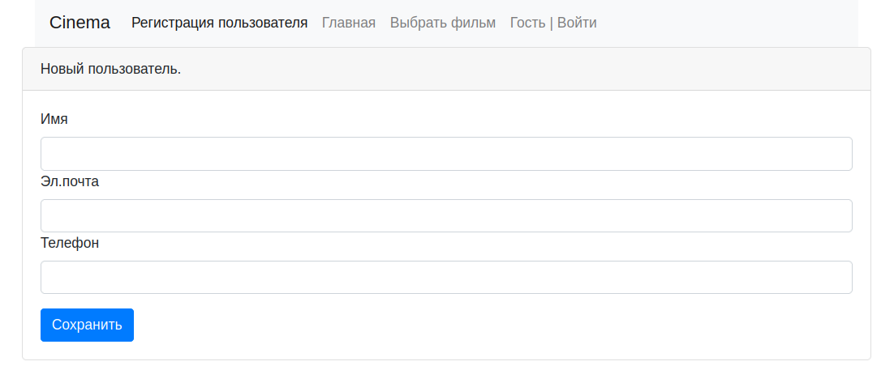
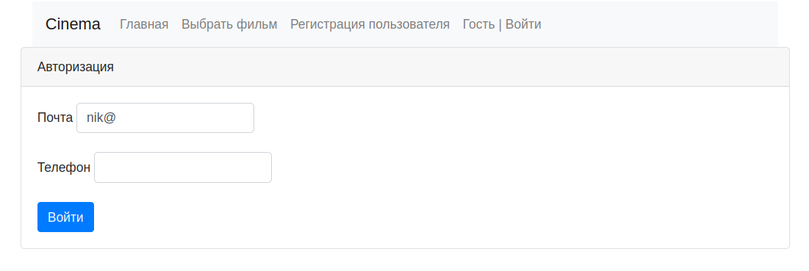
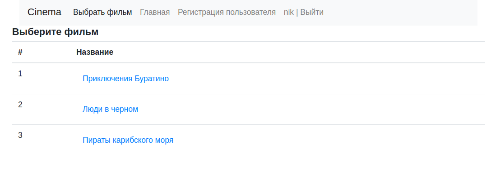
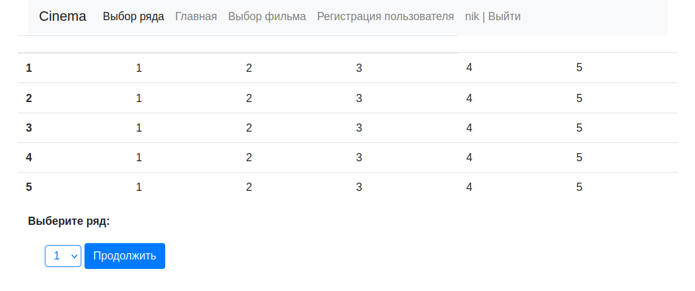
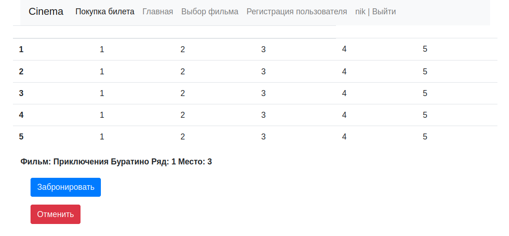

# job4j_cinema

----
[](https://github.com/SergeyPoletaev/job4j_cinema/actions)
[](https://codecov.io/gh/SergeyPoletaev/job4j_cinema)

### Описание проекта:

Это приложение - сервис по покупке билетов в кинотеатр.  
Пользователь заходит на web-сайт, регистрируется и далее авторизуется под своей учетной записью.  
При переходе на страницу выбора фильма и следуя инструкциям на экране пользователь может выбрать понравившийся фильм,
ряд и место в зрительном зале. После этого можно либо забронировать выбранный билет либо отменить выбор.  
Успешное бронирование происходит только при условии, что выбранные текущем пользователям места не были забронированы
ранее.

### Стек технологий:

* Java 17
* Maven 3.8
* Spring Boot 2
* Thymeleaf 3
* Bootstrap 5
* PostgreSQL 14
* JDBC
* Liquibase

### Требования к окружению:

* Java 17
* Maven 3.8
* PostgreSQL 14

### Запуск проекта:

1. Настроить подключение к серверу БД в соответствии с настройками из файла    
   ./job4j_cinema/src/main/resources/db.properties  
   либо изменить настройки на свои.
2. Создать базу данных, например через утилиту psql:

``` 
create database cinema 
```

3. Упаковать проект в jar архив. Для этого в папке с проектом выполнить:

``` 
mvn package 
```  

Архив jar будет находится в папке: ./job4j_cinema/target/job4j_cinema-1.0-SNAPSHOT.jar

4. Запустить приложение командой:

``` 
java -jar job4j_cinema-1.0-SNAPSHOT.jar 
```

### Взаимодействие с приложением:

*регистрируемся ...*



*авторизуемся ...*



*выбираем фильм ...*



*выбираем ряд и далее место ...*



*бронируем билет ...*



